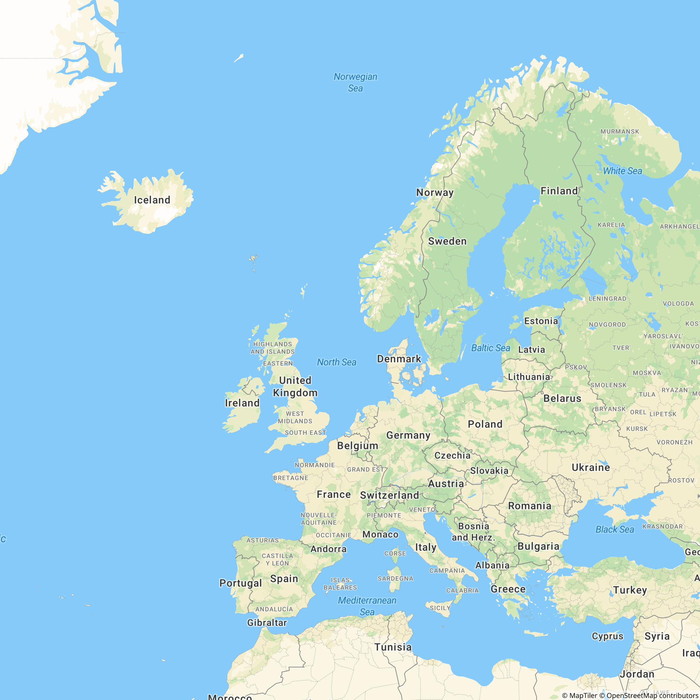
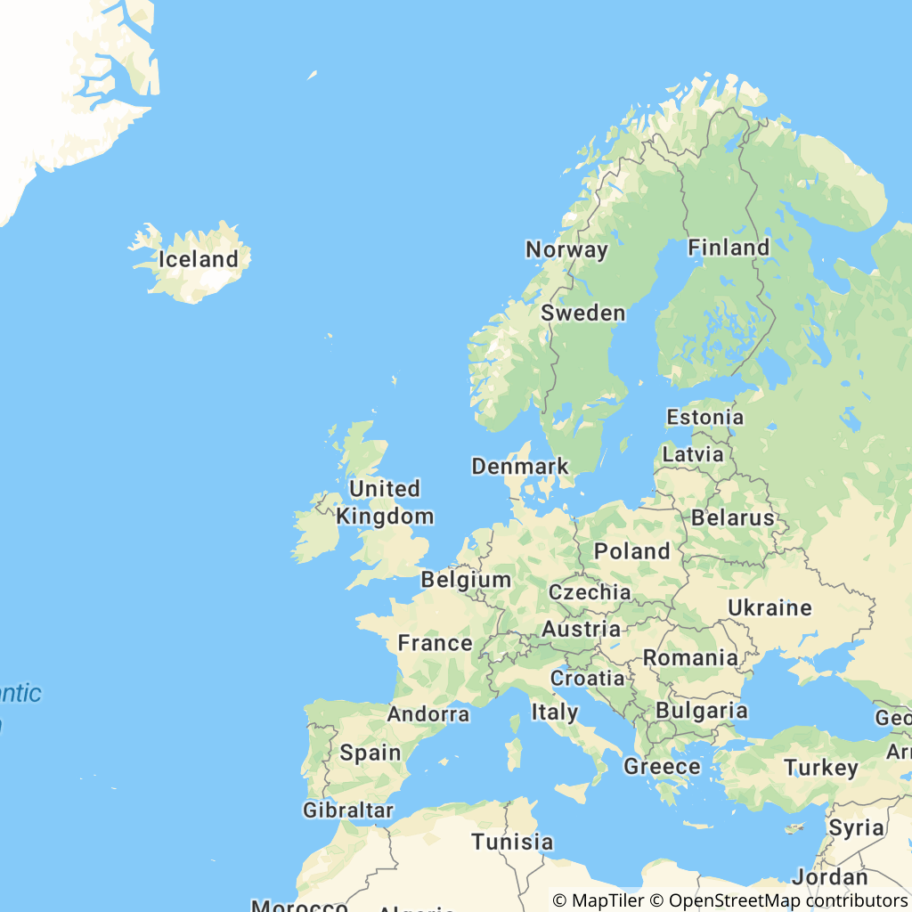
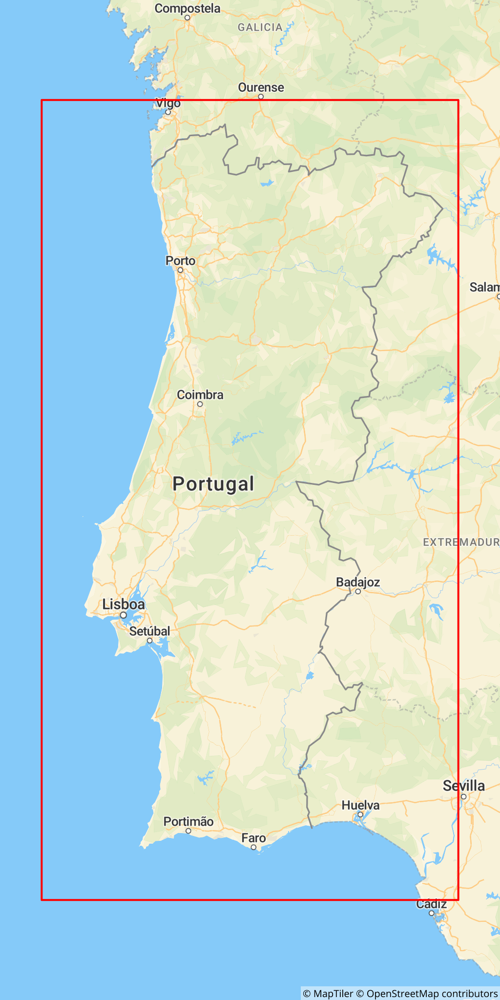

<p align="center">
  
</p>

<p align="center" style="color: #AAA">
  The Javascript & TypeScript API client library to enjoy <a href="https://www.maptiler.com/cloud/">MapTiler Cloud</a>'s <br>services such as geocoding, geolocation and more!
</p>

<p align="center">
  
  
  </img>
  </img>
</p>

# What and why?
The **MapTiler Client JS** exposes a number of handy functions that wrap API call to [MapTiler Cloud API services](https://docs.maptiler.com/cloud/api), such as:
- Geocoding forward and reverse
- Geolocation from visitor's IP address
- Coordidinate systems search and tranform
- User data fetching as GeoJSON
- Static maps of all sorts

The project is entirely written in TypeScript and all the function arguments are nicely documented and typed.

> 📣 *__Note:__* If you need *this* API wrapper **AND** a complete SDK to display beautiful interactive maps, then checkout [MapTiler SDK JS](https://github.com/maptiler/maptiler-sdk-js), it contains it all!

# Install
```shell
npm install --save @maptiler/client
```

# API documentation
In addition to the details and examples provided in this readme, check out the [complete API documentation](https://maptiler.github.io/maptiler-client-js).

# Quick start
```ts
// Import the whole library
import * as maptilerClient from '@maptiler/client';

// Or import only the bits you need
import {
  config,
  geocoding,
  geolocation,
  coordinates,
  data,
  staticMaps,
} from '@maptiler/client';
```

The [examples](examples/) folder includes are featuring usages for **NodeJS**, **browser with UMD** and **browser with ES module**.

# Easy access to MapTiler Cloud API
Here is the list of service wrapper functions that are built-in:

## 🔍 Geocoding
### Forward
You want to know the longitude and latitude of a specific place, use the forward geocoding:
```ts
// in an async function, or as a 'thenable':
const result = await maptilerClient.geocoding.forward('paris');
```
You can provide some options such as:
- the proximity, given a lon-lat position, to sort the results
- one of more languages to get the results into
- a bounding geo box, to restrict the search to a given window

Read more about forward geocoding on our official [API documentation](https://docs.maptiler.com/cloud/api/geocoding/#search-by-name-forward).

### Reverse
You wan to tknow the name of a place, given a longitude-latitude? Use the reverse geocoding:
```ts
// in an async function, or as a 'thenable':
const result = await maptilerClient.geocoding.reverse({ lng: 6.249638, lat: 46.402056 });
```
The same option object as the forward geocoding can be provided.

Read more about reverse geocoding on our official [API documentation](https://docs.maptiler.com/cloud/api/geocoding/#search-by-coordinates-reverse).

### Language
For both *forward* and *reverse* geocoding, this library provides a list of supported languages as shorthands to [ISO language codes](https://en.wikipedia.org/wiki/ISO_639-1). The result will be provided in multiple languages if the `language` options is an array:

```ts
const result = await maptilerClient.geocoding.forward('bordeaux', {language: [maptilerClient.languageGeocoding.SPANISH, maptilerClient.languageGeocoding.KOREAN]})
```

The special language `AUTO` will detect the plateform/browser prefered language.

## 🕵️‍♂️ Geolocation
The geolocation service provides an accurate location insight of a website visitor using its IP address.

There is only a single function:
```ts
// in an async function, or as a 'thenable':
const result = await maptilerClient.geolocation.info();
```

Read more about geolocation on our official [API documentation](https://docs.maptiler.com/cloud/api/geolocation/).

## 🌐 Coordinates
If you are already familiar with [epsg.io](https://epsg.io/) (created by MapTiler), then you may find convenient to access the details of more than 10 thousands of coordinate reference systems (CRS) programmatically, as well as transforming coordinates from one system to another!

### Search
The `search` lets you perform a query in a free form fashion. Here are some examples:
```ts
// in an async function, or as a 'thenable':
const resultA = await maptilerClient.coordinates.search('mercator');
const resultB = await maptilerClient.coordinates.search('plate carree');
const resultC = await maptilerClient.coordinates.search('france');
const resultD = await maptilerClient.coordinates.search('code:4326', {transformations: true}));
```

The `transformations` options retrieves a lot more details about the CRS that MapTiler API is able to transform to/from than just their IDs.

Read more about searching coordinate systems on our official [API documentation](https://docs.maptiler.com/cloud/api/coordinates/#search-coordinate-systems).

### Transform
Transforming a couple of coordinates from one system to another can be challenging, for example, most countries have their own official system, yet web mapping tools are more often than not exclusive to [WGS84](https://epsg.io/4326).

If not provided, both the source (`sourceCrs`) and the destination (`targetCrs`) are default to **EPSG:4326** (in other words, [WGS84](https://epsg.io/4326)). Here is how to use this feature:

```ts
// in an async function, or as a 'thenable':

// Providing one coordinate to transform, with a target CRS being EPSG:9793 (RGF93 v2 / Lambert-93, France official CRS)
const resultA = await maptilerClient.coordinates.transform({lng: 1, lat: 45}, {targetCrs: 9793})

// Using the same logic, we can pass up to 50 coordinates to be transformed
const resultB = await maptilerClient.coordinates.transform([{lng: 10, lat: 48}, {lng: 1, lat: 45}], {targetCrs: 9793})
```

Read more about transforming coordinates on our official [API documentation](https://docs.maptiler.com/cloud/api/coordinates/#transform-coordinates).

## 💽 Data
MapTiler Cloud give its users the possibility to [upload and create data](https://cloud.maptiler.com/data/), manually with a user interface or by uploading a GPX, GeoJSON, KML or shp file. A unique ID is associated to each dataset so that we can later on access it programmatically to retrieve a GeoJSON equivalent of it:

```ts
// in an async function, or as a 'thenable':
const result = await maptilerClient.data.get('my-dataset-unique-id')
```

Since the result is a GeoJSON, it can easily be added to a `map` with `.addSource()` and `.addLayer()`.

## 🗺️ Static maps
Maptiler Cloud provides many possibilities for creating static maps as PNG, JPEG or WebP images. They all offer the possibilities to:
- Choose from one of the MapTiler style or your own
- Add markers with a custom icon (or default icon with custom color)
- Add path or polygon, with a parametric line width and color and a parametric filling color

Three modes are available: `centered`, `bounded` and `automatic`.

> 📣 *__important:__* Contrary to the geolocation/geocoding/coordinates/data service wrappers, the static maps function **does not** perform any query to the MapTiler API, instead they build the image URL. We took this decision because images are most likely going to be displayed  in `</img>` markups and will naturaly be fetched by the web browser.

### Centered static maps
This type of map is centered on a longitude-latitude coordinate and the zoom level must also be provided (from `0`: very zoomed out, to `22`: very zoomed in).  
Note that if a path or markers are provided, the framing of the map will not automatically adapt to include those (use the `automatic` mode for that).

```ts
const imageLink = maptiler.staticMaps.centered(
  // center position (Boston)
  {lng: -71.06080, lat: 42.362114}, 

  // zoom level
  12.5, 
  
  // Options
  {
    // Request a hiDPI/Retina image
    hiDPI: true,

    // Output image size
    width: 1000,
    height: 1000,

    // Map style
    style: 'streets-v2',
  });
```

Read more about centered static maps on our official [API documentation](https://docs.maptiler.com/cloud/api/static-maps/#center-based-image).


### Bounded static maps
This type of map requires a bounding box made of two points: the south-west bound and the north-east bound. The zoom level cannot be provided and is automatically deduced from the size of the bounding box.

```ts
const imageLink = maptiler.staticMaps.bounded(
  // The bounding box on Europe
  {
    southWest: { lng: -24, lat: 34.5 },
    northEast: { lng: 32, lat: 71 },
  },

  // Options
  {
    hiDPI: true,
    width: 2048,
    height: 2048,
    style: 'streets-v2',

    // Extra space that will add around the bounding box, in percentage
    // (0.1 = 10% is actually the dafault)
    padding: 0.1
  });
```

Since the zoom level cannot be provided, the level of details is dictated by the size of the output image. here is an example:

| `2048 x 2048`      | `1024 x 1024` |
| :-----------: | :-----------: |
|       |        |

As you may notice, the geo bounding box could have very different proportions than the output image size. In the following example, we place the very same bounding box around Portugal, which has a this particular strip looking shape. We also add a `path` that repeats exactely the same bounding box to show the difference between the provided bounding box and the final image. We kept the default padding of 10%:


| `2048 x 2048`      | `1024 x 2048` |
| :-----------: | :-----------: |
|       |        |


Read more about bounded static maps on our official [API documentation](https://docs.maptiler.com/cloud/api/static-maps/#bounds-based-image).

### Automatic static maps
As we have seen with centered and bounded maps, providing all the parameters is nice but can be cumbersome for the simplest use cases. This is why MapTiler Cloud also provides static maps that fits automatically whatever you need to place inside: path or markers.

In the following example, we are going to load a cycling track recorded by one of our team members in Montreal, Canada. The track, originally a GPX file, was pushed to MapTiler Data and is now made avalable as a GeoJSON:

```ts
// Fetching the GeoJSON
const bikeTrack = await maptilerClient.data.get('the-id-of-a-bike-track-in-montreal');

// Extracting the track points with the shape [[lng, lat], [lng, lat], ...]
const trackPoints = bikeTrack.features[0].geometry.coordinates[0]
  .map(p => p.slice(0, 2));

// We will need the starting point to create a nice marker
const departure = { lng: trackPoints[0][0], lat: trackPoints[0][1] };

const imageLink = maptiler.staticMaps.automatic({
  // hiDPI/Retina precision
  hiDPI: true,

  // A farily large output image
  width: 2048,
  height: 1024 ,

  // A grey style on which the track will pop!
  style: 'streets-v2-light',

  // Draw a path with the trackpoints
  path: trackPoints,

  // Adding a marker for the starting point, with a custom color
  marker: {lng: trackPoints[0][0], lat: trackPoints[0][1], color: '#0a0'},

  // Showing the track in red
  pathStrokeColor: 'red',
});
```

And voila!


> 📣 *__Note:__* The GeoJSON for this track contains 9380 couples of coordinates, which is a lot! In order to send the track to MapTiler Cloud static maps API, the client simplifies the long paths while keeing a high degree of precision using a very fast [Ramer-Douglas-Peucker algorithm](https://en.wikipedia.org/wiki/Ramer%E2%80%93Douglas%E2%80%93Peucker_algorithm).

Read more about bounded static maps on our official [API documentation](https://docs.maptiler.com/cloud/api/static-maps/#auto-fitted-image).

# From NodeJS
NodeJS includes a stable `fetch()` function only fronm its version *18*, and this client does not contain a polyfill. If the `fetch()` function exists (browser or Node >= 18) then it is going to be resolved automatically, Yet, a custom `fetch()` function can be provided to the `config` object for Node < 18.

In [this NodeJS example](examples/test-node.js), you can see that the package [Node Fetch](https://www.npmjs.com/package/node-fetch) has been `npm install`ed and is passed to the config obejct of the *MapTiler Client*.

```js
import {
  config,
  // ...
} from '@maptiler/client';

// For this example to work, you must bring your own node-compatible fetch,
// unles you are using a version of Nodejs that already contains fetch (>=18)
import fetch from 'node-fetch';

config.fetch = fetch;

// ...
```